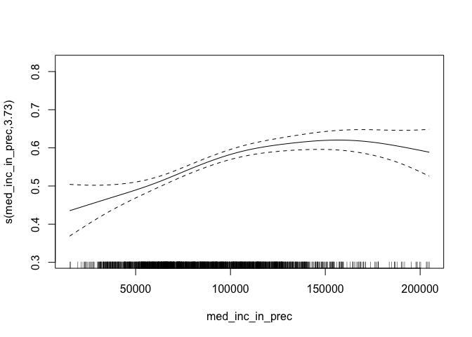
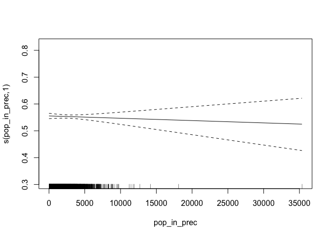
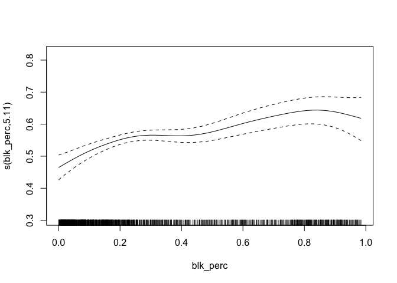
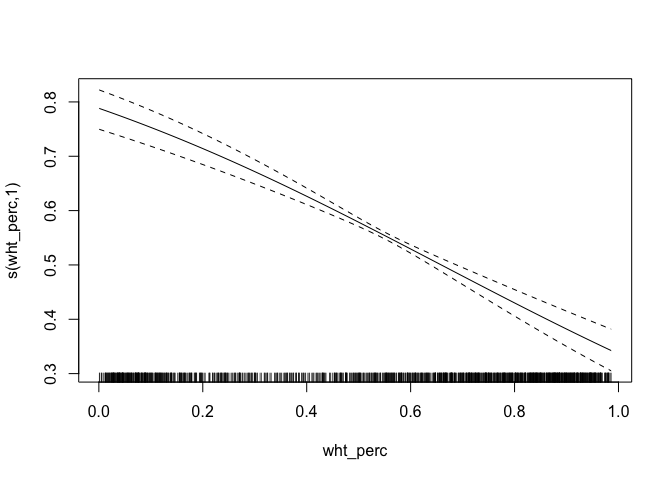
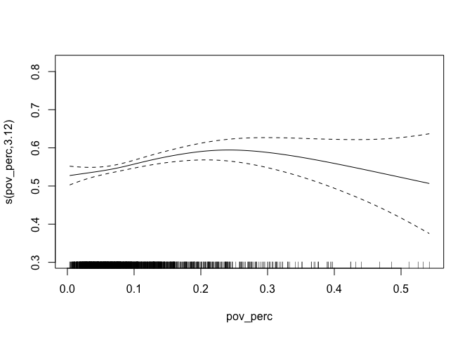
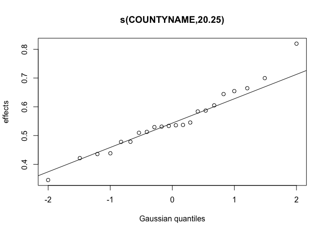
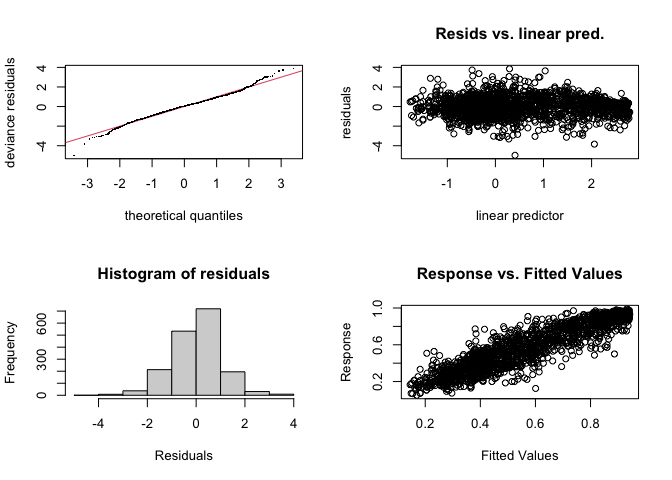

2022 Gubernatorial post-election analysis
================
Nick Thieme
2022-11-11

## Library

``` r
##2022 Maryland general voting block calcuation###

#### load library functions

library(xml2)
library(tidyverse)
```

    ## ── Attaching packages ─────────────────────────────────────── tidyverse 1.3.2 ──
    ## ✔ ggplot2 3.3.6     ✔ purrr   0.3.4
    ## ✔ tibble  3.1.7     ✔ dplyr   1.0.9
    ## ✔ tidyr   1.2.0     ✔ stringr 1.4.0
    ## ✔ readr   2.1.2     ✔ forcats 0.5.1
    ## ── Conflicts ────────────────────────────────────────── tidyverse_conflicts() ──
    ## ✖ dplyr::filter() masks stats::filter()
    ## ✖ dplyr::lag()    masks stats::lag()

``` r
library(deldir)
```

    ## deldir 1.0-6      Nickname: "Mendacious Cosmonaut"
    ## 
    ##      The syntax of deldir() has had an important change. 
    ##      The arguments have been re-ordered (the first three 
    ##      are now "x, y, z") and some arguments have been 
    ##      eliminated.  The handling of the z ("tags") 
    ##      argument has been improved.
    ##  
    ##      The "dummy points" facility has been removed. 
    ##      This facility was a historical artefact, was really 
    ##      of no use to anyone, and had hung around much too 
    ##      long.  Since there are no longer any "dummy points", 
    ##      the structure of the value returned by deldir() has 
    ##      changed slightly.  The arguments of plot.deldir() 
    ##      have been adjusted accordingly; e.g. the character 
    ##      string "wpoints" ("which points") has been 
    ##      replaced by the logical scalar "showpoints". 
    ##      The user should consult the help files.

``` r
library(sf)
```

    ## Linking to GEOS 3.9.1, GDAL 3.4.2, PROJ 8.2.1; sf_use_s2() is TRUE

``` r
library(tidycensus)
library(geojsonsf)
library(viridis)
```

    ## Loading required package: viridisLite

``` r
library(httr)
library(curl)
```

    ## Using libcurl 7.79.1 with LibreSSL/3.3.5
    ## 
    ## Attaching package: 'curl'
    ## 
    ## The following object is masked from 'package:httr':
    ## 
    ##     handle_reset
    ## 
    ## The following object is masked from 'package:readr':
    ## 
    ##     parse_date

``` r
library(scales)
```

    ## 
    ## Attaching package: 'scales'
    ## 
    ## The following object is masked from 'package:viridis':
    ## 
    ##     viridis_pal
    ## 
    ## The following object is masked from 'package:purrr':
    ## 
    ##     discard
    ## 
    ## The following object is masked from 'package:readr':
    ## 
    ##     col_factor

``` r
library(mgcv)
```

    ## Loading required package: nlme
    ## 
    ## Attaching package: 'nlme'
    ## 
    ## The following object is masked from 'package:dplyr':
    ## 
    ##     collapse
    ## 
    ## This is mgcv 1.8-40. For overview type 'help("mgcv-package")'.

``` r
library(effects)
```

    ## Loading required package: carData
    ## lattice theme set by effectsTheme()
    ## See ?effectsTheme for details.

``` r
library(rmapshaper)
```

    ## Registered S3 method overwritten by 'geojsonlint':
    ##   method         from 
    ##   print.location dplyr

``` r
sf_use_s2(FALSE)
```

    ## Spherical geometry (s2) switched off

## Getting the data

This notebook is split into two parts. One where we show how we get the
data, the other where we show our analysis. We start with the first.

The precinct-level data comes from the State Board of Elections in XML
format, which is a bit of a pain to parse, but totally doable. We do two
things here. First, we import the precinct shapefiles, which are
available from the Maryland Department of Plannings with the exception
of Montgomery County and Kent County, which did not report their
shapefiles to MDP. We clean up and format those shapefiles in a way that
allows us to link the precinct data from SBE with the shapefiles from
MDP. Fortunately, that’s not that hard (there’s a regular transformation
between the two, unlike in GA).

That’s what happens in this first chunk.

``` r
counties <- c("Allegany County","Anne Arundel County","Baltimore City","Baltimore County",
              "Calvert County","Caroline County","Carroll County","Cecil County",
              "Charles County","Dorchester County","Frederick County","Garrett County",
              "Harford County","Howard County","Kent County","Montgomery County",
              "Prince George's County","Queen Anne's County","St. Mary's County","Somerset County",
              "Talbot County","Washington County","Wicomico County","Worcester County")

D_counties<-tibble(name = counties, number = 1:length(counties)) %>% mutate(name = str_remove(name, " County"))

#load precincts. we put this up top because we don't need it in the loop
acs_names<-get_acs(geography = "county", state="MD", variables="B19013_001") %>% select(GEOID, NAME) %>%arrange(NAME) %>%  add_column(number_county = 1:nrow(.))

precincts_geo<-read_sf("~/Desktop/banner_projects/general_election_22/Maryland_Election_Boundaries_-_Precincts_2022/BNDY_Precincts2022_MDP.shp") %>% st_transform(4236) %>% st_set_crs(4326)

##there are 4 precincts (22-1003, 22-1804, 23-1106, 24-303) that have two geometries. i'm concatenating them for now.
precincts_geo_f<-precincts_geo %>% 
  left_join(D_counties, by = c("COUNTYNAME"="name")) %>% 
  mutate(VTD_join = str_split(LABEL, "-") %>% lapply(
    function(x){
      if(length(x)==1){
        ans = str_c(x, "00", collapse = "")
      }else{
        new_latter_half<-x[2] %>% str_remove("0")#str_replace("00", "0")
        ans<-str_c(x[1] %>% as.numeric, new_latter_half, collapse = "")
      }
    }
  ) %>% unlist
  ) %>% 
  filter(number%in%c(15,16)==FALSE) %>% 
  data.frame %>% 
  group_by(number, VTD_join) %>% 
  summarise(COUNTY = COUNTY[1],
            COUNTYNAME = COUNTYNAME[1],
            LABEL = LABEL [1],
            NAME = NAME[1],
    new_geo = st_union(geometry))
```

Next, we make calls every ten minutes to the SBE’s election website to
download the XML data. This allows us to see what information came in
each batch of results. In the end, we didn’t use this, but I’d rather
have the data and not use it than want to use it an not have it. The
inner loop parses the XML into tidy data so that we can link it with the
precinct files. Nothing fancy, just took some time.

``` r
##this is the loop to get the data. i'm doing 432 because every 10 minutes means 6 an hour, i'm giving 72 hours of runtime. we get the time, pull the zip file from the website
##unzip the file to a new folder named after the time, parse the xml, and save that a csv inside the folder. we do that every ten minutes.

for(i in 1:432){
  time_name <- Sys.time() %>% str_replace_all(.," ", "_") %>% str_replace_all("-","_") %>% str_replace_all(":","_")
  file_name <- str_c("~/Desktop/banner_projects/general_election_22/pulled_data/xml_results_",time_name, ".zip")
  file_link <- "https://elections.maryland.gov/elections/results_data/xml_results_2022gg.zip"
  
  download.file(url = file_link, 
                destfile = file_name, 
                method="curl")
  
  output_directory <- str_c("~/Desktop/banner_projects/general_election_22/pulled_data/", time_name, "/")
  
  unzip(file_name, exdir = output_directory)
  
  
  ##this is the loop to parse the data
  file_list <- list.files(output_directory)
  file_list_keep <- file_list %>% str_detect("Results_MD.XML") %>% {which(.)}
  file_list_f<- file_list[file_list_keep]
  D_tot_precs <- tibble()
  
  ##loop to parse data. could turn these loops into lapplys (like the inner one) to speed up parse
  for(k in 1:length(file_list_f)){
    
    county_name = str_sub(file_list_f[k],1,2)
    
    D_1<-read_xml(str_c(output_directory, file_list_f[k]))
    
    races<-D_1 %>% xml_find_all("//ContestList") %>% xml_contents
    
    
    for(i in 1:length(races)){
      curr_race <- races[i]
      title <- curr_race %>% xml_attr(., "title")
      total_cast<-curr_race %>% xml_attr(., "ballotsCast")
      
      cand_list<-curr_race %>% xml_contents
      cand_names<-cand_list %>% xml_attr(.,"name")
      
      for(j in 1:length(cand_list)){
        precinct_list<-cand_list[j] %>% xml_contents
        prec_names<-precinct_list %>% xml_attr(.,"refPrecinctId")
        
        vote_tots<-lapply(precinct_list, function(x)return(x %>% xml_contents %>% xml_text()))
        vote_tots_f<-vote_tots[-which(is.na(prec_names))] %>% do.call("rbind",.)
        vote_tots_f_2<-cbind(vote_tots_f, prec_names[-which(is.na(prec_names))],cand_name = cand_names[j], race_name = title, county = county_name) %>% as_tibble
        names(vote_tots_f_2)<-c("Early", "election_day","Mail","tot","perc", "prec_name","cand_name","race_name","county")
        
        D_tot_precs <- rbind(D_tot_precs, vote_tots_f_2)
        
      }
      
      print( str_c("done with ", i, " of ", length(races), " races"))
    }
    
    print( str_c("done with ", k, " of ", length(file_list_f), " counties"))
  }
  
  #D_tot_precs %>% group_by(race_name, county, cand_name) %>% summarise(early = sum(as.numeric(Early)), election = sum(as.numeric(election_day)))
  write_csv(D_tot_precs,str_c(output_directory, "xml_results.csv"))
  
  print(str_c("last iteration was: ", i , " which is file: ", time_name))
  
  Sys.sleep(600)
}
```

## Analysis

Next is the analysis of that data and others. We use, effectively, three
datasets. Precinct-level results from the SBE this time around,
precinct-level results from 2018 maintained by the Metric Geometry and
Gerrymandering Group
[here](https://github.com/mggg-states/MD-shapefiles), and Census data
from the U.S. Census Bureau.

First we read in the older data and format it to make it useful. We also
bin the data and calculate some features that show up in the map.
Lastly, we write out shapefiles and data files that are needed to
produce our maps. We do this for 2018 and 2022, at the state-level and
also at the City/County level.

``` r
D_tot_precs_f <- read_csv("~/Desktop/banner_projects/general_election_22/pulled_data/2022_11_09_17_10_17/xml_results.csv")%>% 
  mutate(county = as.numeric(county),
         VTD_join = prec_name %>% as.character) 
```

    ## Rows: 166285 Columns: 9
    ## ── Column specification ────────────────────────────────────────────────────────
    ## Delimiter: ","
    ## chr (3): cand_name, race_name, county
    ## dbl (6): Early, election_day, Mail, tot, perc, prec_name
    ## 
    ## ℹ Use `spec()` to retrieve the full column specification for this data.
    ## ℹ Specify the column types or set `show_col_types = FALSE` to quiet this message.

``` r
D_precincts_joined<-D_tot_precs_f %>% filter(county%in%c(15,16)==FALSE) %>% left_join(precincts_geo_f, by = c("VTD_join","county"= "number"))

D_precincts_joined_sf<-D_precincts_joined %>% st_as_sf


D_older_votes_sf <- read_sf("~/Desktop/banner_projects/general_election_22/MD_precincts/MD-precincts.shp") %>% 
  select(NAME, COUNTY, VTD, STATE, ADJ_POP, ADJ_BLACK, ADJ_WHITE, TOTPOP, GOV18R, GOV18D)

bins = c(0, .25,.50,.75,1)

D_older_votes_sf_city_county<-D_older_votes_sf %>% filter(COUNTY%in%c(  24005, 24510)) %>% mutate(
  winner = case_when(GOV18R>GOV18D~"Hogan",
                     GOV18D>GOV18R~"Jealous"),
  
  winning_perc = case_when(GOV18R>GOV18D~GOV18R/(GOV18R+GOV18D),
                          GOV18D>GOV18R~GOV18D/(GOV18R+GOV18D)) %>% 
    cut(., bins) %>% str_split(.,",") %>%
    lapply(function(x)return(x[[1]])) %>% unlist %>% 
    str_remove("\\(") %>% as.numeric,
  
  winning_perc = case_when(GOV18R>GOV18D~winning_perc,
                           GOV18D>GOV18R~winning_perc*(-1))
  ) %>%
  st_transform(crs = '+proj=aeqd +lat_0=53.6 +lon_0=12.7')

D_older_votes_sf_city_county_simp <- ms_simplify(D_older_votes_sf_city_county, keep = 0.05,  keep_shapes = FALSE) %>% 
  st_transform(4326)

#D_older_votes_sf_city_county_simp %>% ggplot()+geom_sf()

# st_write(D_older_votes_sf_city_county_simp %>% select(VTD, everything()), dsn = "~/Desktop/banner_projects/general_election_22/city_state_2018.GeoJSON", 
#          layer = "precinct", driver = "GeoJSON", delete_dsn = T)

D_older_votes_sf_city_county_simp_f<-D_older_votes_sf_city_county_simp %>% tibble %>% select(-geometry) %>%
  mutate(
    tooltip_text = str_c(winner," won between ", abs(winning_perc)*100, "% and ", (abs(winning_perc)+.25)*100,"% of the votes in this precinct")
  )

# D_older_votes_sf_city_county_simp_f %>% write_csv("~/Desktop/banner_projects/general_election_22/data_city_state_2018.csv")

##same thing statewide
D_older_votes_sf_city_county<-D_older_votes_sf %>% mutate(
  winner = case_when(GOV18R>GOV18D~"Hogan",
                     GOV18D>GOV18R~"Jealous"),
  
  winning_perc = case_when(GOV18R>GOV18D~GOV18R/(GOV18R+GOV18D),
                           GOV18D>GOV18R~GOV18D/(GOV18R+GOV18D)) %>% 
    cut(., bins) %>% str_split(.,",") %>%
    lapply(function(x)return(x[[1]])) %>% unlist %>% 
    str_remove("\\(") %>% as.numeric,
  
  winning_perc = case_when(GOV18R>GOV18D~winning_perc,
                           GOV18D>GOV18R~winning_perc*(-1))
) %>%
  st_transform(crs = '+proj=aeqd +lat_0=53.6 +lon_0=12.7')

D_older_votes_sf_city_county_simp <- ms_simplify(D_older_votes_sf_city_county, keep = 0.05,  keep_shapes = FALSE) %>% 
  st_transform(4326)

# st_write(D_older_votes_sf_city_county_simp %>% select(VTD, everything()), dsn = "~/Desktop/banner_projects/general_election_22/state_2018.GeoJSON", 
#          layer = "precinct", driver = "GeoJSON", delete_dsn = T)

D_older_votes_sf_city_county_simp_f<-D_older_votes_sf_city_county_simp %>% tibble %>% select(-geometry) %>%
  mutate(
    tooltip_text = str_c(winner," won between ", abs(winning_perc)*100, "% and ", (abs(winning_perc)+.25)*100,"% of the votes in this precinct")
  )


# D_older_votes_sf_city_county_simp_f%>% write_csv("~/Desktop/banner_projects/general_election_22/data_state_2018.csv")
# 

# D_older_votes_sf %>% mutate(
#   winner = case_when(GOV18R>GOV18D~"Hogan",
#                      GOV18D>GOV18R~"Jealous")
# ) %>% ggplot(aes(color = winner, fill = winner))+
#   geom_sf()

##doing the same thing for the newest election data

cands = c("Cox","Moore","Lashar", "Wallace", "Harding","Write")

governors_race<-D_precincts_joined_sf  %>% tibble %>% filter(race_name=="Governor / Lt. Governor")%>%
  filter(county%in%c(3,4)) %>% 
  mutate(tots=Early+election_day+Mail) %>% 
  select(-Early, -election_day, - Mail, -tot, -perc) %>% 
  pivot_wider(names_from = cand_name, values_from = tots) %>% rowwise %>% 
  mutate(which_max = which.max(c(`Cox-Schifanelli`, `Moore-Miller`,`Lashar-Logansmith`,`Wallace-Elder`,`Harding-White`,`WRITE-IN`)),
         actual_max = max(c(`Cox-Schifanelli`, `Moore-Miller`,`Lashar-Logansmith`,`Wallace-Elder`,`Harding-White`,`WRITE-IN`)),
         name_winner = cands[which_max]
  ) %>% mutate( 
    winning_perc = case_when(name_winner=="Cox"~`Cox-Schifanelli`/(`Cox-Schifanelli`+`Moore-Miller`+`Lashar-Logansmith`+`Wallace-Elder`+`Harding-White`+`WRITE-IN`),
                             name_winner=="Moore"~`Moore-Miller`/(`Cox-Schifanelli`+`Moore-Miller`+`Lashar-Logansmith`+`Wallace-Elder`+`Harding-White`+`WRITE-IN`)) %>% 
      cut(., bins) %>% str_split(.,",") %>%
      lapply(function(x)return(x[[1]])) %>% unlist %>% 
      str_remove("\\(") %>% as.numeric,
    winning_perc = case_when(name_winner=="Cox"~winning_perc,
                             name_winner=="Moore" ~winning_perc*(-1)),
    VTD = str_c(COUNTYNAME,"-", prec_name) ) %>% 
  st_as_sf

# st_write(governors_race %>% select(VTD, everything()), dsn = "~/Desktop/banner_projects/general_election_22/city_state_2022.GeoJSON", 
#          layer = "precinct", driver = "GeoJSON", delete_dsn = T)

governors_race_f_data<-governors_race %>% tibble %>% select(-new_geo) %>%
  mutate(
    tooltip_text = str_c(name_winner," won between ", abs(winning_perc)*100, "% and ", (abs(winning_perc)+.25)*100,"% of the votes in this precinct"),
    tooltip_text=case_when(
      abs(winning_perc)==.25~str_c(name_winner," won this precinct with less than 50% of the vote"),
      abs(winning_perc)!=.25~tooltip_text
    )
  )


# governors_race_f_data%>% write_csv("~/Desktop/banner_projects/general_election_22/data_city_state_2022.csv")

##samething statewide

governors_race<-D_precincts_joined_sf  %>% tibble %>% filter(race_name=="Governor / Lt. Governor") %>% 
  mutate(tots=Early+election_day+Mail) %>% 
  select(-Early, -election_day, - Mail, -tot, -perc) %>% 
  pivot_wider(names_from = cand_name, values_from = tots) %>% rowwise %>% 
  mutate(which_max = which.max(c(`Cox-Schifanelli`, `Moore-Miller`,`Lashar-Logansmith`,`Wallace-Elder`,`Harding-White`,`WRITE-IN`)),
         actual_max = max(c(`Cox-Schifanelli`, `Moore-Miller`,`Lashar-Logansmith`,`Wallace-Elder`,`Harding-White`,`WRITE-IN`)),
         name_winner = cands[which_max]
  ) %>% mutate( 
    winning_perc = case_when(name_winner=="Cox"~`Cox-Schifanelli`/(`Cox-Schifanelli`+`Moore-Miller`+`Lashar-Logansmith`+`Wallace-Elder`+`Harding-White`+`WRITE-IN`),
                             name_winner=="Moore"~`Moore-Miller`/(`Cox-Schifanelli`+`Moore-Miller`+`Lashar-Logansmith`+`Wallace-Elder`+`Harding-White`+`WRITE-IN`)) %>% 
      cut(., bins) %>% str_split(.,",") %>%
      lapply(function(x)return(x[[1]])) %>% unlist %>% 
      str_remove("\\(") %>% as.numeric,
    winning_perc = case_when(name_winner=="Cox"~winning_perc,
                             name_winner=="Moore" ~winning_perc*(-1)),
    VTD = str_c(COUNTYNAME,"-", prec_name) ) %>% 
  st_as_sf

MD_county_ACS <- get_acs(geography = "county", state = "MD",variables = "B17001_002", geometry = T, summary_var = "B01001_001")
```

    ## Getting data from the 2016-2020 5-year ACS
    ## Downloading feature geometry from the Census website.  To cache shapefiles for use in future sessions, set `options(tigris_use_cache = TRUE)`.

    ##   |                                                                              |                                                                      |   0%  |                                                                              |                                                                      |   1%  |                                                                              |=                                                                     |   1%  |                                                                              |=                                                                     |   2%  |                                                                              |==                                                                    |   2%  |                                                                              |==                                                                    |   3%  |                                                                              |===                                                                   |   4%  |                                                                              |====                                                                  |   5%  |                                                                              |====                                                                  |   6%  |                                                                              |=====                                                                 |   7%  |                                                                              |=====                                                                 |   8%  |                                                                              |======                                                                |   8%  |                                                                              |======                                                                |   9%  |                                                                              |=======                                                               |   9%  |                                                                              |=======                                                               |  10%  |                                                                              |========                                                              |  11%  |                                                                              |========                                                              |  12%  |                                                                              |===========                                                           |  15%  |                                                                              |===========                                                           |  16%  |                                                                              |============                                                          |  17%  |                                                                              |=============                                                         |  18%  |                                                                              |=============                                                         |  19%  |                                                                              |==============                                                        |  20%  |                                                                              |==============                                                        |  21%  |                                                                              |===============                                                       |  22%  |                                                                              |==================                                                    |  26%  |                                                                              |===================                                                   |  27%  |                                                                              |========================                                              |  35%  |                                                                              |=========================                                             |  35%  |                                                                              |=========================                                             |  36%  |                                                                              |==========================                                            |  38%  |                                                                              |===========================                                           |  38%  |                                                                              |============================                                          |  40%  |                                                                              |============================                                          |  41%  |                                                                              |=================================                                     |  48%  |                                                                              |==================================                                    |  49%  |                                                                              |===================================                                   |  50%  |                                                                              |===========================================                           |  61%  |                                                                              |===========================================                           |  62%  |                                                                              |============================================                          |  62%  |                                                                              |============================================                          |  64%  |                                                                              |=============================================                         |  64%  |                                                                              |==============================================                        |  66%  |                                                                              |===============================================                       |  66%  |                                                                              |=================================================                     |  71%  |                                                                              |==================================================                    |  71%  |                                                                              |==================================================                    |  72%  |                                                                              |===================================================                   |  73%  |                                                                              |====================================================                  |  74%  |                                                                              |=====================================================                 |  76%  |                                                                              |======================================================                |  77%  |                                                                              |========================================================              |  80%  |                                                                              |================================================================      |  92%  |                                                                              |======================================================================| 100%

``` r
to_add<-MD_county_ACS %>% filter(str_detect(NAME, "Kent")|str_detect(NAME, "Montgomery")) %>% add_column(VTD="none") %>% select(VTD)
governors_race_2<-governors_race %>% select(VTD) %>% rename(geometry = new_geo) %>% st_set_crs(st_crs(to_add))
```

    ## Warning: st_crs<- : replacing crs does not reproject data; use st_transform for
    ## that

``` r
layer_geo<-rbind(governors_race_2,to_add )


# st_write(layer_geo, dsn = "~/Desktop/banner_projects/general_election_22/state_2022.GeoJSON", 
#          layer = "precinct", driver = "GeoJSON", delete_dsn = T)

governors_race_f_data<-governors_race %>% tibble %>% select(-new_geo) %>%
  mutate(
    tooltip_text = str_c(name_winner," won between ", abs(winning_perc)*100, "% and ", (abs(winning_perc)+.25)*100,"% of the votes in this precinct"),
    
    tooltip_text=case_when(
      abs(winning_perc)==.25~str_c(name_winner," won this precinct with less than 50% of the vote"),
      abs(winning_perc)!=.25~tooltip_text
    )
  )

# governors_race_f_data %>% write_csv("~/Desktop/banner_projects/general_election_22/data_state_2022.csv")
```

\#Census analysis

Everything up till now has been extremely straightforward and required
no real choices to be made. However, to make the interesting statement
we make about the relationship between race and vote type, we have to
make some assumptions. Our assumption, which is not true but appears to
be close enough to be useful, is the standard assumption of linear
interpolation. That population is equally distributed geographically.
Obviously that is wrong, but as you get to smaller and smaller
geographies it becomes more true. We’re working with census tracts and
voting precincts, both of which turn out to be small enough to not
change overall totals *too much*.

What am I talking about? Well, precinct-level vote data only gives us
the number of votes cast for each candidate in a precinct, it doesn’t
tell us anything about the demographics of the people casting those
votes. If we want to say something about the demographics of the people
casting those votes, we either need precinct-level voter registration
data (which we’re still working on getting) or we need Census data. Even
if we do have voter registration data, Census data gives us many more
relevant variables to work with.

However, precincts and census tracts almost never align exactly.
Sometimes different parts of several tracts overlap a precinct,
sometimes a precinct is wholly contained within a tract. To combine the
two, we need a way of spatially joining data from different geometric
units. The simplest way of doing this is linear interpolation. You
assume that within a census tract the population is evenly distributed
and assign to the precinct it overlaps a percentage of the population in
the tract equal to the percentage overlap of the tract and precinct. For
variables like median income, you can calculate a population and overlap
weighted average. This isn’t perfect but it usually works pretty good,
and we can check how our estimated totals for the different variables
match the actual totals to get a rough sense of how close we got.

This process is what we do in the next block of code. It’s pretty slow.
I’m sure there’s a way to lapply it faster, but I just haven’t done
that. Maybe next election

``` r
MD_acs<-get_acs(geography = "tract", state = "MD",
                   variables=c(med_inc="B19013_001",white = "B02001_002", 
                               black = "B02001_003", 
                               poverty = "B17001_002"), geometry = T, summary_var = "B01001_001"
) %>% 
  pivot_wider(-moe,names_from = "variable", values_from = "estimate") %>% 
  mutate(county = str_split(NAME,"County")) %>% as.data.frame %>% 
  mutate(county = 
           str_split(NAME, "County") %>% lapply(
  function(x){
    return(x[[1]])
  }
) %>% unlist %>% 
  str_split(.,", ") %>% 
  lapply(
    function(x)return(x[[2]])
  ) %>% unlist %>% trimws
)  %>% st_as_sf

st_crs(D_precincts_joined_sf)<-st_crs(MD_acs)

D_precincts_joined_cens<-st_join(D_precincts_joined_sf,MD_acs)


county_prec_combos<-D_precincts_joined_cens %>% as.data.frame%>% select(county=county.x, prec_name) %>% distinct
L_lin_interp<-vector(mode = "list", length = nrow(county_prec_combos) )

for(i in 1:length(L_lin_interp)){
  
  #the last two filters aren't important, really, i just need them to reduce the overhead
  
  multiple_precinct_tract_matches<-D_precincts_joined_cens %>% filter(county.x==county_prec_combos[i,]$county, prec_name == county_prec_combos[i,]$prec_name, 
                                                        race_name=="Governor / Lt. Governor", cand_name == "Cox-Schifanelli")
  
  which_county <- multiple_precinct_tract_matches$COUNTYNAME %>% unique
  
  if(which_county=="Baltimore City"){
    which_county= "Baltimore city"
  }
  
  prec_matches<-multiple_precinct_tract_matches %>% data.frame %>% mutate(precinct_area = st_area(new_geo), geometry = new_geo) %>%
    select(county=county.x, prec_name,precinct_area,new_geo) %>% st_as_sf()
  
  census_county_matches<-MD_acs %>% filter(county==which_county) %>% mutate(tot_area = st_area(geometry))

tmp_match<- st_intersection(prec_matches, census_county_matches) %>% distinct  %>% mutate(perc_area=precinct_area/tot_area)

  
if(nrow(tmp_match)==1){
  L_lin_interp[[i]]<-tmp_match%>% 
    mutate(
      white_in_prec = perc_area*white,
      black_in_prec = perc_area*black,
      poverty_in_prec = perc_area*poverty,
      pop_in_prec = summary_est*perc_area,
      med_inc_in_prec = med_inc) %>% 
    select(county, prec_name, NAME, white_in_prec, black_in_prec, poverty_in_prec,med_inc_in_prec,pop_in_prec)
}else{
  L_lin_interp[[i]]<-tmp_match%>% 
    mutate(area = st_area(new_geo),
           perc_area = area/tot_area,
           white_in_prec = perc_area*white,
           black_in_prec = perc_area*black,
           poverty_in_prec = perc_area*poverty,
           pop_in_prec = summary_est*perc_area) %>% 
    group_by(county, prec_name) %>% 
    summarise(
      NAME = NAME[1],
      white_in_prec = sum(white_in_prec),
      black_in_prec = sum(black_in_prec),
      poverty_in_prec = sum(poverty_in_prec),
      med_inc_in_prec = sum(med_inc*pop_in_prec)/sum(pop_in_prec),
      pop_in_prec = sum(pop_in_prec)
    )
}
#print(str_c(i, " of ", length(L_lin_interp)))
}

D_interp_census<-L_lin_interp %>% do.call("rbind",.)
```

The next chunk is some code used to check how close we get. If we go
through this process and sum the estimated population of the state, we
get an overall population of 4.7m. That *seems* terrible. But remember
that the SBE didn’t provide us with the shapefiles for Montgomery and
Kent County, so those counties aren’t included in our process. Together,
those counties have about 1.06m people, so we’re somewhere around 5.8m.
With the population of MAryland at 6.1m, we’re actually quite close
(about 6% off).

We do this for all the variables we end up using. The Black population
of Maryland is about 1.8, with the MoCo / Kent County fix we’re at 1.7m.
We almost exactly nail the white population. There are 531k in poverty
in Maryland, we have a corrected total of 495k. It’s important to
remember that we’re using household median income. We come pretty close,
but are little bit over ($89k vs $87k). Overall, this is reassuring that
what we’re doing makes sense at a high-level. Since we’re using this
interpolated data to analyze trends in averages and conditional
averages, these checks are reassuring.

``` r
D_interp_census %>% 
  mutate(elems=pop_in_prec*med_inc_in_prec) %>% 
  group_by() %>% 
  mutate(tot_pop = sum(pop_in_prec)) %>% 
  ungroup %>% 
  mutate(rat=elems/tot_pop) %>% 
  pull(rat) %>% sum(na.rm = T)
```

    ## 89373.29 [1]

Just about everything else from here is used to produce charts in the
story, so I don’t include the R versions of those plots, just the code.

``` r
cands = c("Cox","Moore","Lashar", "Wallace", "Harding","Write")

governors_race<-D_precincts_joined  %>% filter(race_name=="Governor / Lt. Governor")%>%
  mutate(tots=Early+election_day+Mail) %>% 
  select(-Early, -election_day, - Mail, -tot, -perc) %>% 
  pivot_wider(names_from = cand_name, values_from = tots) %>% rowwise %>% 
  mutate(which_max = which.max(c(`Cox-Schifanelli`, `Moore-Miller`,`Lashar-Logansmith`,`Wallace-Elder`,`Harding-White`,`WRITE-IN`)),
         actual_max = max(c(`Cox-Schifanelli`, `Moore-Miller`,`Lashar-Logansmith`,`Wallace-Elder`,`Harding-White`,`WRITE-IN`)),
         name_winner = cands[which_max]
  ) %>% 
  st_as_sf


st_crs(governors_race)<-st_crs(MD_acs)
```

    ## Warning: st_crs<- : replacing crs does not reproject data; use st_transform for
    ## that

``` r
##census governor stuff
governors_race_f<-governors_race %>% tibble %>% 
  left_join(D_interp_census %>% data.frame, by = c("prec_name", "county")) %>% 
  mutate(across(ends_with("in_prec"), as.numeric), 
         blk_perc = black_in_prec/pop_in_prec,
         wht_perc = white_in_prec/pop_in_prec,
         pov_perc = poverty_in_prec/pop_in_prec,
         maj_black = blk_perc>.5,
         
         maj_black = case_when(maj_black~"Black",
                               maj_black==FALSE~"non-Black"),
         
         moore_perc = `Moore-Miller`/(`Moore-Miller`+`Cox-Schifanelli`+`Lashar-Logansmith`+`Wallace-Elder`+`Harding-White`+`WRITE-IN`),
         cox_perc = `Cox-Schifanelli`/(`Moore-Miller`+`Cox-Schifanelli`+`Lashar-Logansmith`+`Wallace-Elder`+`Harding-White`+`WRITE-IN`),
         
         
  ) 

(governors_race_f %>% filter(COUNTYNAME =="Baltimore"))[215:250,] %>% select(name_winner,moore_perc, cox_perc) %>% print(n = 100)
```

    ## # A tibble: 36 × 3
    ##    name_winner moore_perc cox_perc
    ##    <chr>            <dbl>    <dbl>
    ##  1 Moore            0.472    0.459
    ##  2 Moore            0.643    0.326
    ##  3 Cox              0.389    0.565
    ##  4 Cox              0.370    0.588
    ##  5 Cox              0.305    0.663
    ##  6 Moore            0.528    0.425
    ##  7 Moore            0.620    0.344
    ##  8 Cox              0.226    0.732
    ##  9 Cox              0.398    0.561
    ## 10 Cox              0.403    0.564
    ## 11 Cox              0.291    0.673
    ## 12 Moore            0.495    0.457
    ## 13 Moore            0.503    0.453
    ## 14 Cox              0.304    0.659
    ## 15 Cox              0.273    0.688
    ## 16 Cox              0.276    0.687
    ## 17 Cox              0.299    0.646
    ## 18 Cox              0.363    0.585
    ## 19 Moore            0.603    0.351
    ## 20 Cox              0.359    0.602
    ## 21 Cox              0.303    0.664
    ## 22 Cox              0.285    0.677
    ## 23 Cox              0.238    0.733
    ## 24 Cox              0.223    0.748
    ## 25 Moore            0.771    0.193
    ## 26 Cox              0.459    0.498
    ## 27 Cox              0.443    0.527
    ## 28 Cox              0.185    0.768
    ## 29 Cox              0.263    0.699
    ## 30 <NA>            NA       NA    
    ## 31 <NA>            NA       NA    
    ## 32 <NA>            NA       NA    
    ## 33 <NA>            NA       NA    
    ## 34 <NA>            NA       NA    
    ## 35 <NA>            NA       NA    
    ## 36 <NA>            NA       NA

``` r
dw_point_plot<-governors_race_f %>%select(moore_perc, blk_perc, wht_perc) %>% 
  pivot_longer(-moore_perc, names_to = "type", values_to = "race_percentage") %>% 
  mutate(race_percentage = race_percentage*100,
         moore_perc = moore_perc*100) %>% 
  filter(type=="blk_perc")

#write_csv(dw_point_plot, file = "~/Desktop/banner_projects/general_election_22/dw_point_plot_race_perc.csv")
```

I do, however, want to include the modeling we use to support our
statement that the relationship between race and Moore vote share isn’t
just geography in disguise. I’m generally partial to mixed-effect Beta
GAMs for these kinds of problems, but, as always, I train-test fit a
variety of models. What you’ll see below is a model that does a great
job of predicting Moore’s vote share from census variables, including
race, and a random effect for the county name. I also include partial
effects plots and GAM diagnostics to show that the model seems to be
well-specified.

``` r
gov_mod<-governors_race_f %>% select(COUNTYNAME, med_inc_in_prec, pop_in_prec, blk_perc, wht_perc,pov_perc, name_winner, moore_perc) %>% 
  filter(is.na(moore_perc)==FALSE, moore_perc!=0, moore_perc!=1) %>% 
  mutate(name_winner = as_factor(name_winner),
         COUNTYNAME = as_factor(COUNTYNAME))

mod_perc<-gam(moore_perc~s(med_inc_in_prec)+s(pop_in_prec)+s(blk_perc)+s(wht_perc)+s(pov_perc)+s(COUNTYNAME, bs="re"), family = betar(), data = gov_mod)

plot(mod_perc, trans = plogis, shift = coef(mod_perc)[1], seWithMean = TRUE)
```

<!-- --><!-- --><!-- --><!-- --><!-- --><!-- -->

``` r
summary(mod_perc)
```

    ## 
    ## Family: Beta regression(20.253) 
    ## Link function: logit 
    ## 
    ## Formula:
    ## moore_perc ~ s(med_inc_in_prec) + s(pop_in_prec) + s(blk_perc) + 
    ##     s(wht_perc) + s(pov_perc) + s(COUNTYNAME, bs = "re")
    ## 
    ## Parametric coefficients:
    ##             Estimate Std. Error z value Pr(>|z|)  
    ## (Intercept)   0.2134     0.1028   2.075    0.038 *
    ## ---
    ## Signif. codes:  0 '***' 0.001 '**' 0.01 '*' 0.05 '.' 0.1 ' ' 1
    ## 
    ## Approximate significance of smooth terms:
    ##                       edf Ref.df   Chi.sq  p-value    
    ## s(med_inc_in_prec)  3.731  4.718   55.080  < 2e-16 ***
    ## s(pop_in_prec)      1.001  1.003    0.333  0.56440    
    ## s(blk_perc)         5.110  6.224   30.418 3.61e-05 ***
    ## s(wht_perc)         1.001  1.002  104.734  < 2e-16 ***
    ## s(pov_perc)         3.116  3.968   15.538  0.00329 ** 
    ## s(COUNTYNAME)      20.247 21.000 1035.593  < 2e-16 ***
    ## ---
    ## Signif. codes:  0 '***' 0.001 '**' 0.01 '*' 0.05 '.' 0.1 ' ' 1
    ## 
    ## R-sq.(adj) =  0.856   Deviance explained = 87.5%
    ## -REML = -1735.2  Scale est. = 1         n = 1746

``` r
gam.check(mod_perc)
```

<!-- -->

    ## 
    ## Method: REML   Optimizer: outer newton
    ## full convergence after 10 iterations.
    ## Gradient range [-0.0003099155,0.0001067856]
    ## (score -1735.202 & scale 1).
    ## Hessian positive definite, eigenvalue range [0.0002594364,867.9549].
    ## Model rank =  68 / 68 
    ## 
    ## Basis dimension (k) checking results. Low p-value (k-index<1) may
    ## indicate that k is too low, especially if edf is close to k'.
    ## 
    ##                       k'   edf k-index p-value
    ## s(med_inc_in_prec)  9.00  3.73    1.01    0.72
    ## s(pop_in_prec)      9.00  1.00    1.01    0.59
    ## s(blk_perc)         9.00  5.11    1.02    0.76
    ## s(wht_perc)         9.00  1.00    0.98    0.18
    ## s(pov_perc)         9.00  3.12    0.99    0.28
    ## s(COUNTYNAME)      22.00 20.25      NA      NA

Here’s the stuff about weed.

``` r
D_precincts_joined  %>% filter(race_name=="Question 4") %>% 
  mutate(cand_name = case_when(cand_name =="For the Constitutional Amendment"~"Legalize",
                               cand_name =="Against the Constitutional Amendme"~"Criticise"
                               )) %>% 
  mutate(total = Early+election_day+Mail) %>% 
  select(-new_geo, -Early,-election_day,-Mail,-tot,-perc) %>% 
  pivot_wider(names_from = cand_name, values_from=total) %>% 
  left_join(D_interp_census, by = c("prec_name", "county")) %>% 
 mutate(across(ends_with("in_prec"), as.numeric), 
        prec_legal = Legalize/(Legalize+Criticise),
        legalize = Legalize>Criticise,
        legalize = case_when(legalize~"Legalize",
                             legalize==FALSE~"Criticise"),
        blk_perc = black_in_prec/pop_in_prec*100
        ) %>% select(legalize, blk_perc)
```

    ## # A tibble: 1,806 × 2
    ##    legalize blk_perc
    ##    <chr>       <dbl>
    ##  1 Legalize    0.464
    ##  2 Legalize    0.464
    ##  3 Legalize    0.464
    ##  4 Legalize   11.5  
    ##  5 Legalize    4.79 
    ##  6 Legalize   13.3  
    ##  7 Legalize    5.23 
    ##  8 Legalize    4.10 
    ##  9 Legalize    1.75 
    ## 10 Legalize    1.76 
    ## # … with 1,796 more rows
    ## # ℹ Use `print(n = ...)` to see more rows

``` r
# %>% 
 # ggplot(aes(x = legalize, y = blk_perc))+
  #geom_violin()

#i think this second plot is better. shows the larger black support more clearly
dw_violin<-D_precincts_joined  %>% filter(race_name=="Question 4") %>% 
  mutate(cand_name = case_when(cand_name =="For the Constitutional Amendment"~"Legalize",
                               cand_name =="Against the Constitutional Amendme"~"Criticise"
  )) %>% 
  mutate(total = Early+election_day+Mail) %>% 
  select(-new_geo, -Early,-election_day,-Mail,-tot,-perc) %>% 
  pivot_wider(names_from = cand_name, values_from=total) %>% 
  left_join(D_interp_census, by = c("prec_name", "county")) %>% 
  mutate(across(ends_with("in_prec"), as.numeric), 
         prec_legal = Legalize/(Legalize+Criticise),
         legalize = Legalize>Criticise,
         
         legalize = case_when(legalize~"Legalize",
                              legalize==FALSE~"Criticise"),
         
         blk_perc = black_in_prec/pop_in_prec,
         maj_black = blk_perc>.5,
         
         maj_black = case_when(maj_black~"Black",
                              maj_black==FALSE~"non-Black"),
         
  ) %>% select(maj_black, prec_legal, Legalize, Criticise) %>% 
  group_by(maj_black) %>% 
  summarise(
    Minimum = min(prec_legal, na.rm = T)*100,
    percentile_25 = quantile(prec_legal, .25, na.rm = T)*100,
    median= median(prec_legal, na.rm = T)*100,
    percentile_75 = quantile(prec_legal, .75, na.rm = T)*100,
    Maximum = max(prec_legal, na.rm = T)*100,
    perc_support=sum(Legalize)/(sum(Legalize)+sum(Criticise))
  )

fl_violin<-D_precincts_joined  %>% filter(race_name=="Question 4") %>% 
  mutate(cand_name = case_when(cand_name =="For the Constitutional Amendment"~"Legalize",
                               cand_name =="Against the Constitutional Amendme"~"Criticise"
  )) %>% 
  mutate(total = Early+election_day+Mail) %>% 
  select(-new_geo, -Early,-election_day,-Mail,-tot,-perc) %>% 
  pivot_wider(names_from = cand_name, values_from=total) %>% 
  left_join(D_interp_census, by = c("prec_name", "county")) %>% 
  mutate(across(ends_with("in_prec"), as.numeric), 
         prec_legal = Legalize/(Legalize+Criticise)*100,
         legalize = Legalize>Criticise,
         
         legalize = case_when(legalize~"Legalize",
                              legalize==FALSE~"Criticise"),
         
         blk_perc = black_in_prec/pop_in_prec,
         maj_black = blk_perc>.5,
         
         maj_black = case_when(maj_black~"Black",
                               maj_black==FALSE~"non-Black"),
         voted_pop = Legalize+Criticise
         
  ) %>% select(maj_black, prec_legal, voted_pop) %>% 
  mutate(color = prec_legal>50,
         color = case_when(color~"Yes",
                           color==FALSE~ "No")) %>% na.omit

# write_csv(dw_violin, file = "~/Desktop/banner_projects/general_election_22/dw_violin_race_legalize.csv")
# write_csv(fl_violin, file = "~/Desktop/banner_projects/general_election_22/fl_violin_race_legalize.csv")
```
